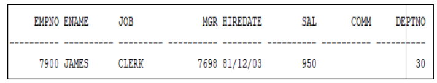
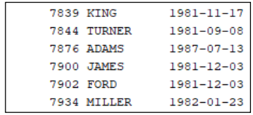
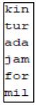
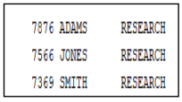
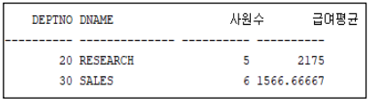
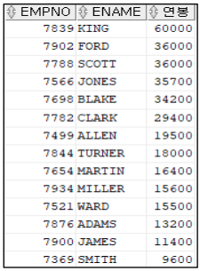
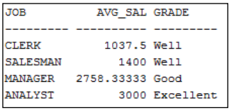
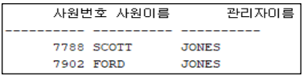
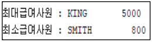

# [과제1] SQL 실습

### 문제 1) 사원이름의 2번째 글자가 A인 사원의 모든 정보를 검색하라(단, 사원이름은 5자리로 구성되어야 한다)
실행 결과

### 문제 2) 사원번호가 7800 이상인 사원의 사원번호, 사원이름, 입사일(hiredate)을 검색하라. 이 때, 입사일은 아래 결과에 나타난 형태로 검색되어야 한다. 
실행 결과

### 문제 3) 사원번호가 7800 이상인 사원의 사원이름을 앞에서 3자만 구하여 소문자로 사원이름만을 검색하라.
실행 결과

### 문제 4) 20번 부서 사람들 중에서 10번 부서의 사원과 같은 업무를 하는 사원의 사원번호, 사원이름, 부서명을 검색하라. 이 때, 사원이름순(오름차순)으로 정렬하여 검색하라. 
실행 결과

### 문제 5) 4명 이상의 사원을 갖는 부서에 대해, 급여(sal) 평균이 1000 이상인 부서의 부서번호(dno),부서이름 (dname),사원수,급여 평균을 검색하라. 
실행 결과

### 문제 6) 사원 정보를 검색하여, 사원 번호, 사원 이름, 연봉을 아래와 같이 출력하라 (연봉이 큰 값에서 작은 값순 출력)
연봉 계산식은 다음과 같다.
- 연봉 = 월급*12 + 보너스 /* 월급 : sal, 보너스 : comm */

실행 결과

### 문제 7) 업무( job)별 평균 급여, 평균 급여 상태(아래 설명 참고)를 다음과 같이 검색하라. 이 때, 관리자(mgr)가 있는 사원만을 대상으로 한다.
평균 급여 상태
- 평균 급여 >= 3000 : ‘Excellent’
- 평균 급여 >= 2000 : ‘Good’
- 위의 어떤 경우도 아니면 ‘Well

실행 결과

### 문제 8) 'JONES’가 직속 관리자인 모든 사원 정보를 검색하라 (‘JONES’가 관리하는 직속 부하사원을 모두 검색하라). 
실행 결과

### 문제 9) 최대급여를 받는 사원의 이름과 급여, 최소급여를 받는 사원의 이름과 급여를 아래와 같은 형태로 검색 하라. 
실행 결과

