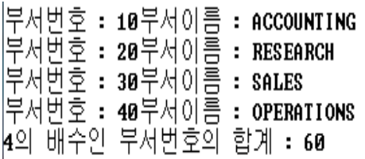
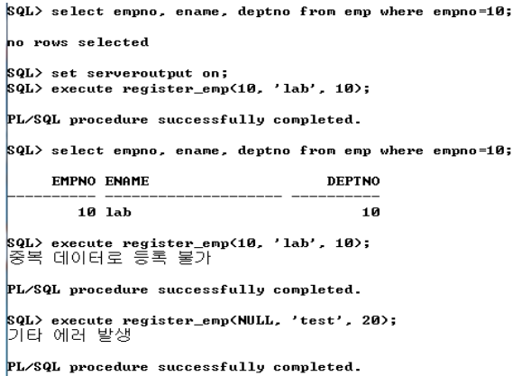

# [과제 1]

다음과 같은 PL/ SQL 프로그램을 작성하라.(이름이 없는 PL/ SQL 블록 사용하여 작성할 것) 
모든 부서 정보(부서번호,부서이름)를 검색하여 출력하라. 이때, 부서번호가 4의 배수인 부서번호들의 합계를 구하여 출력하라. (변수 선언시 %TYPE 데이터형을 1개 이상 사용하라). 
참고) 부서 정보 : dept 테이블 사용 

# [과제 2]

다음과 같은 프로시저를 작성하라. 
사원번호(empno), 사원명(ename), 부서번호(deptno)를 입력받아 emp 테이블에 insert하는 프로시저 
▣ 프로시저명 : register_emp 
▣ 프로시저 인자 : NUMBER형, VARCHAR2형, NUMBER형 
(사원번호, 사원명, 부서번호에 해당하는 타입) 
▣ 예외처리 
◈ 이미 등록된 사원번호 입력시 ‘중복 데이터로 등록 불가’ 메시지 출력 : DUP_VAL_ON_INDEX 사용 
◈ 기타 에러시 ‘기타 에러 발생’ 메시지 출력 : OTHERS 사용 

참고) 프로시저의 정상적 실행 확인 방법 
작성한 프로시저가 제대로 실행되는지는 다음과 같은 방법으로 확인해본다. 

