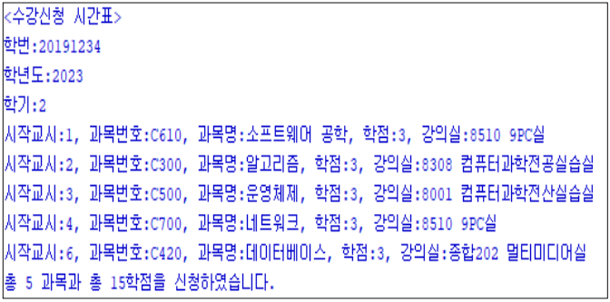
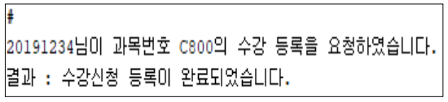
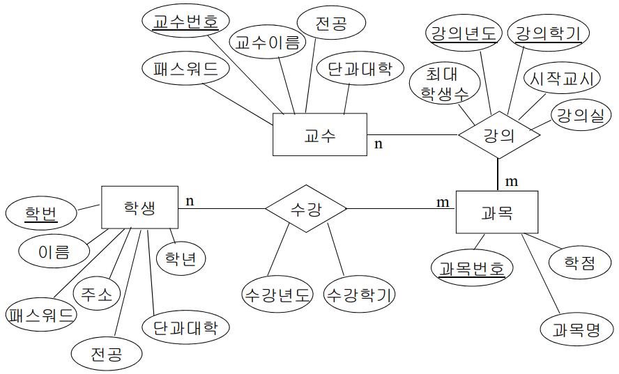
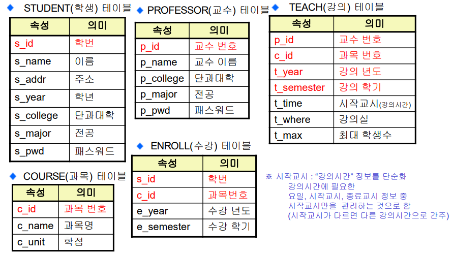

# [미니 프로젝트] 수강신청 시스템

▣요구사항 분석 : 수강신청 시스템  
▣개념적 데이터 모델 : ER-Diagram  
▣논리적 데이터 모델  
◈ER에서 관계형 테이블로 변환  
▣구현 

## 1. 요구사항 분석 : 수강신청 시스템
▣수강 내역 조회 
▣수강 신청 
▣사용자 정보 수정 
 
▣수강 내역 조회 
◈ 입력 : ‘학번’, ‘학년도’, ‘학기’ 
◈ 결과 : 학번,학년도, 학기에 대한 수강신청 내역 화면 출력 

▣수강 신청 
◈입력 : ‘학번’, ‘과목번호’ 
◈결과 : 해당 학생(학번)의 과목(과목번호)을 수강 신청 (수강신청 년도와 학기는 자동 처리) 

▣사용자 정보 수정 
◈사용자(학생) 정보(주소, 패스워드 등)를 수정할 때, 
패스워드 규칙(예:4자리 이상, 공란 허용 안함)에 위반되는 경우 수정 불가능하도록 함 

## 2. 개념적 데이터 모델 : ER 모델

## 3. 논리적 데이터 모델 : 릴레이션 스키마

## 4. 구현 : PL/SQL
▣스키마, 데이터 : 제공 
▣소스 코드 : 일부 제공 
▣요구사항별 구현 방법 
◈수강 내역 조회 : 프로시저 활용 
◈수강 신청 : 프로시저, 함수 활용 
◈사용자 정보 수정 : 트리거 활용
