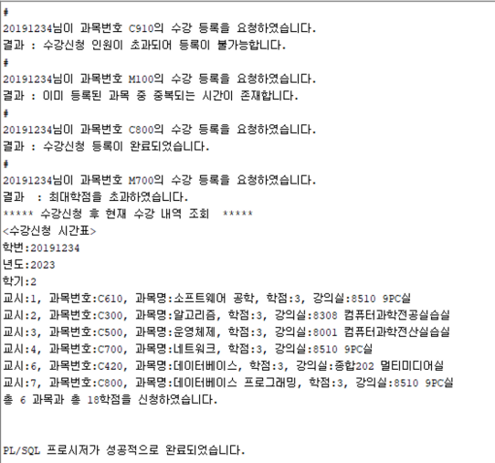

## 1. 요구사항 분석 : 수강신청 시스템
- 수강 내역 조회
  - 프로시저(SelectTimeTable) 작성
- 수강 신청
  - 수강신청 프로시저(InsertEnroll)에서 호출해서 사용할 2개의 함수 작성
    - Date2EnrollYear
    - Date2EnrollSemeste
  - 수강신청 프로시저
- 사용자 정보 수정

### 요구사항
- 사용 사례명 : 수강 신청
  - 액터 : 학생
  - 선행조건 : 로그인
  - 주요 흐름
    1. 학생은 수강신청 하고자 하는 과목을 입력한다
    2. 시스템은 입력한 과목을 수강 신청된 것으로 등록한다. 이 때, 시스템은 최대학점을 초과했는지(E-1), 동일한 과목을 신청했는지 (E-2), 해당과목에 대한 수강신청 인원이 초과되었는지(E-3), 동일한 시간의 다른 과목 이 이미 수강신청 되었는지(E-4)를 검사한다.
- 예외 흐름
  - E-1
    1. 시스템은 입력된 과목에 따라, 총 수강신청 과목의 총학점이 18학점이 초과되는지 검사한다.
    2. 18학점을 초과하면, 시스템은 수강신청이 될 수 없음을 알린다.
  - E-2
    1. 시스템은 입력한 과목이 이미 수강 신청되어 있는 과목인지 검사한다.
    2. 이미 수강 신청되어 있는 과목인 경우, 시스템은 수강신청이 될 수 없음을 알린다
  - E-3
    1. 시스템은 입력한 과목에 대한 수강신청 인원이 초과되었는지 검사한다.
    2. 수강신청 인원이 초과된 과목인 경우, 시스템은 수강신청이 될 수 없음을 알린다.
  - E-4
    1. 시스템은 입력한 과목의 수업 시간과 동일한 시간의 다른 과목이 이미 수강 신청되었는지 검사한다.
    2. 동일한 시간의 다른 과목이 이미 수강 신청되어 있는 경우, 시스템은 수강 신청이 될 수 없음을 알린다.
- 수강신청 년도와 학기에 대한 요구사항
  - 수강신청 년도와 학기는 현재 날짜를 기준으로 자동으로 설정되는 것으로 한다.
  - 현재 날짜가 10월~12월인 경우는 다음 년도 1학기인 것으로 하고, 1월~3월인 경우는 현재 년도 1학기로 하며, 4월~9월은 현재 년도 2학기인 것으로 한다.
- 사용 사례명 : 사용자 정보 수정
  - 액터 : 학생
  - 선행조건 : 로그인
  - 주요 흐름
    1. 학생은 사용자 정보를 수정한다. 이 때, 시스템은 패스워드가 올바른지 검사한다.(E-1)
  - 예외 흐름
    - E- 1
    1. 시스템은 패스워드가 4자리 이상이고, 공란이 포함되어 있지 않은지 검사한다.
    2. 패스워드가 4자리 미만이거나 공란이 포함되어 있으면, 시스템은 수정이 불가능함을 알린다.

## [과제6] 수강 신청 함수 Date2EnrollYear
#### 함수
- Date2EnrollYear(p1)
  - 매개변수 (IN)
    - p1 : 날짜형
  - 리턴 결과
    - 숫자형
    - 수강신청 년도 리턴

## [과제7] 수강 신청 함수 Date2EnrollSemester
### 수강 신청
#### 실행 결과
- 입력 : ‘학번’, ‘과목번호’
- 결과 : 해당 학생(학번)의 과목(과목번호)을 수강 신청 (수강신청 년도와 학기는 자동 처리)

#### 함수
- Date2EnrollSemester (p1)
  - 매개변수 (IN)
    - p1 : 날짜형
  - 리턴 결과
    - 숫자형
    - 수강신청 학기 리턴

## [과제8] 수강 신청 프로시저 InsertEnroll
### 수강신청 프로시저 : InsertEnroll
- InsertEnroll(p1, p2, p3)
  - 매개변수 (IN)
    - p1 : 학번
    - p2 : 과목번호
  - 매개변수 (OUT)
    - p3 : 입력 결과 메시지
      - 수강신청 등록이 완료되었습니다.
      - 최대학점을 초과하였습니다.
      - 이미 등록된 과목을 신청하였습니다.
      - 수강신청 인원이 초과되어 등록이 불가능합니다
      - 이미 등록된 과목 중 중복되는 시간이 존재합니다.
      - 그 외 에러 : SQLCODE
  - 결과
    - 예외흐름이 아닌 경우 ”enroll” 테이블에 학번,과목번호, 수강 년도, 수강 학기가 입력된다.
    - 예외가 발생한 경우는 오류 메시지를 보내고 테이블에 입력되지 않는다.

### 실행 결과

